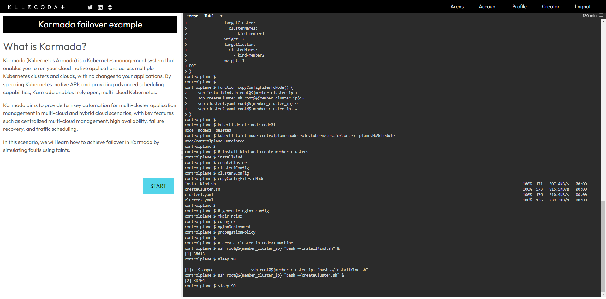

# Karmada Playground Scenarios

Karmada (Kubernetes Armada) is a Kubernetes management system that enables you to run your cloud-native applications across multiple Kubernetes clusters and clouds, with no changes to your applications. By speaking Kubernetes-native APIs and providing advanced scheduling capabilities, Karmada enables truly open, multi-cloud Kubernetes.

So in order to let users try and learn Karmada with an interactive online environment, Karmada provide different scenarios on different platforms.

## Available platforms

You can enjoy tutorial experience about Karmada with following platforms.

### Killercoda platform

* Try [Installing Karmada on Kubernetes through the Karmada CLI](https://killercoda.com/karmada/scenario/karmada-CLI-installtion-example).
* Try [Propagate workload through karmada duplicated mode](https://killercoda.com/karmada/scenario/karmada-HA-workload-example1).
* Try [Propagate workload through karmada divided mode](https://killercoda.com/karmada/scenario/karmada-HA-workload-example2).
* Try [Simulate multitype cluster failover through Karmada](https://killercoda.com/karmada/scenario/karmada-Failover-example).

## Contribution

If you know of any excellent online interactive platforms, we welcome any pull requests to adapt the scenarios to the new platform.
