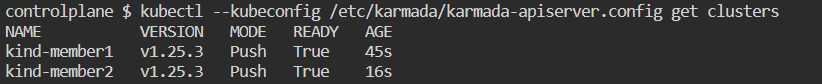

### Join member clusters to the host cluster

1. Join `kind-member1` and `kind-member2` to the host cluster.

   RUN `MEMBER_CLUSTER_NAME=kind-member1`{{exec}}

   This sets the variable `MEMBER_CLUSTER_NAME` to `kind-member1` for use in the join command.

   RUN `karmadactl --kubeconfig /etc/karmada/karmada-apiserver.config join ${MEMBER_CLUSTER_NAME} --cluster-kubeconfig=$HOME/.kube/config-member1 --cluster-context=kind-member1`{{exec}}

   This joins the `kind-member1` cluster to the Karmada control plane using its kubeconfig file and context.

   RUN `MEMBER_CLUSTER_NAME=kind-member2`{{exec}}

   This sets the variable to `kind-member2` for the second cluster join.

   RUN `karmadactl --kubeconfig /etc/karmada/karmada-apiserver.config join ${MEMBER_CLUSTER_NAME} --cluster-kubeconfig=$HOME/.kube/config-member2 --cluster-context=kind-member2`{{exec}}

   This joins the `kind-member2` cluster to the Karmada control plane using its respective kubeconfig file and context.

2. Check Karmada resources.

   RUN `kubectl --kubeconfig /etc/karmada/karmada-apiserver.config get clusters`{{exec}}

   This command lists all the member clusters that have successfully joined the Karmada control plane.
3. The following image shows the expected output, indicating that the member clusters have been joined successfully.

**Note:** If a join command fails due to a transient issue, rerun that specific join command.
