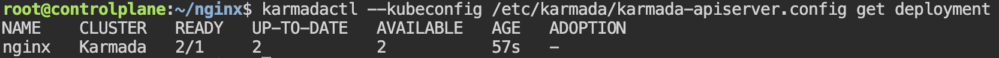

# Verify duplicated distribution across clusters

**Check distributed deployment status:**

RUN `karmadactl --kubeconfig /etc/karmada/karmada-apiserver.config get deployment`{{exec}}

This shows the nginx deployment status aggregated across all member clusters. You should see `2/1` pods READY as shown below. 

The deployment spec defines `1` replica, but Duplicated mode copies it to every cluster, so 2 pods are running in total (1 per cluster).

> **Note:** If READY shows `0/1`, wait ~30 seconds and run the command again — Karmada's scheduler needs a moment to reconcile and propagate the workload to member clusters.

**Check pods on each member cluster directly:**

RUN `karmadactl --kubeconfig /etc/karmada/karmada-apiserver.config get pods --operation-scope members`{{exec}}

Each cluster should show exactly 1 nginx pod running — a full duplicate on each cluster.
