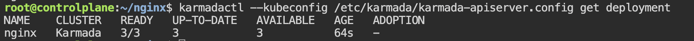

# Verify Weighted Distribution Across Clusters

**Check distributed deployment status:**

RUN `karmadactl --kubeconfig /etc/karmada/karmada-apiserver.config get deployment`{{exec}}

This shows the nginx deployment status aggregated across all member clusters. You should see `3/3` pods READY.

> **Note:** If READY shows `0/3`, wait ~30 seconds and run the command again — Karmada's scheduler needs a moment to reconcile and propagate the workload to member clusters.

**Check the quantity distribution of pods:**

RUN `karmadactl --kubeconfig /etc/karmada/karmada-apiserver.config get pods  --operation-scope members`{{exec}}

This shows the running pods across member clusters. There are 2 pods in `kind-member1` and 1 pod in `kind-member2`.
